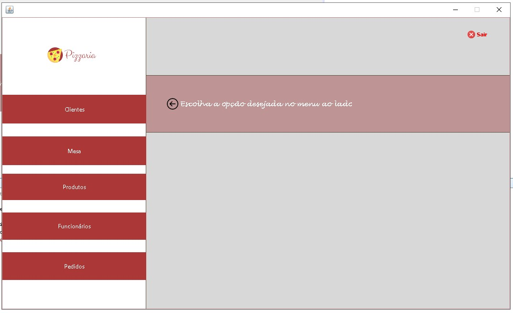
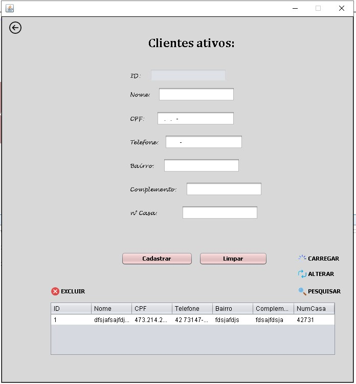

# CRUD-Java
<h1>A simple example of CRUD in Java</h1>

<h4><ul><li>With this basic system it is possible to create, update, search and delete records from a database. The central idea involves the implementation of functionalities that practically any system of pizzeria needs</li></ul></h4>

 

  <h2 align="center">The User Screen:</h2>
  

    
  

 

  <h2 align="center">The Options Screen:</h2>
  

    
  

  

  <h2 align="center">A Example Screen:</h2>
  

    
  

